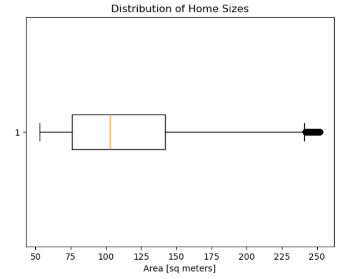

# Cost Driver & Regional Price Analysis Using Python | Brazil Housing Market
This project analyzes 22,000+ real estate listings from Brazil to examine how property size and geographic location influence housing prices.
The analysis includes data cleaning, exploratory data analysis, regional housing market comparison, and correlation analysis to understand pricing patterns in the Brazilian real estate market.

---

## Project Objective
The objective of this project is to explore factors that influence housing prices in Brazil.
Key goals include:
* Preparing and cleaning housing datasets
* Exploring price distributions
* Comparing housing prices across regions
* Analyzing the relationship between property size and price
* Evaluating regional differences in housing markets

---

## Dataset
The dataset contains residential property listings collected from the Properati real estate platform.
The analysis combines two datasets which are cleaned and merged before performing exploratory analysis.

| Feature | Description |
|--------|-------------|
| price_usd | Property price in USD |
| area_m2 | Property size in square meters |
| lat | Latitude coordinate |
| lon | Longitude coordinate |
| state | Brazilian state |
| region | Geographic region of Brazil |

The final dataset contains **22,844 property listings.**

---

## Technologies Used

- **Python** — Programming language used for data analysis  
- **Pandas** — Data cleaning and manipulation  
- **Matplotlib** — Data visualization  
- **Plotly** — Interactive geographic visualization  
- **Jupyter Notebook** — Interactive environment for analysis

---

## Project Workflow
The analysis follows a structured data analysis pipeline:
Import required Python libraries
* Load and clean Dataset 1
* Load and clean Dataset 2
* Merge both datasets
* Perform exploratory data analysis
* Analyze regional housing prices
* Explore relationship between property size and price
* Calculate correlation between size and price in southern states

---

## Project Architecture
The project follows a typical data analytics workflow:

Dataset 1 → Data Cleaning → Dataset 2 → Data Cleaning → Merge Datasets → Exploratory Data Analysis → Regional Price Analysis → Correlation Analysis → Key Insights

---

## Key Findings

- Housing prices vary significantly across Brazilian regions
- The Southeast region has the highest average housing prices
- Property size has a moderate positive relationship with housing price
- Geographic location plays a stronger role in determining property value

---

## Key Visualizations

### Mean Housing Price by Region

Insight: 
The Southeast region has the highest average housing prices, indicating stronger demand and economic activity compared to other regions.

### Distribution of Housing Prices

Insight:
Housing prices are right-skewed, meaning most properties fall in the lower to mid-price range, with fewer high-priced listings.

### Price vs Property Size

Insight:  
There is a moderate positive relationship between property size and price, although variation suggests location also influences housing values.

### Distribution of Property Sizes

Insight:
There is a moderate positive relationship between property size and price, but price variation suggests that location also influences property values.

### Property Size Distribution

Insight:
Most properties fall within a moderate size range, with a few larger properties appearing as outliers.
---

## Repository Structure
```
brazil-housing-price-analysis
│
├── data
│   ├── brasil-real-estate-1.csv
│   └── brasil-real-estate-2.csv
├── images
│   ├── Mean_Price_by_Region_Chart.png
│   ├── Price_Distribution.png
│   ├── Price_vs_Property_Size.png
│   └── Property_Size_Boxplot.png
├── notebooks
│   └── housing_pricing_in_brazil.ipynb
│
├── requirements.txt
└── README.md
```
## How to Run the Project
1. Clone the repository: git clone https://github.com/Rishav-20/brazil-housing-price-analysis.git
2. Navigate to the project folder
3. Install dependencies: pip install -r requirements.txt
4.Open the Jupyter Notebook in the notebooks folder and run the analysis

---

## Future Improvements

* Building a machine learning model for price prediction
* Adding interactive dashboards
* Incorporating additional housing features such as property type or amenities

---

## Author

Rishav Sharma
